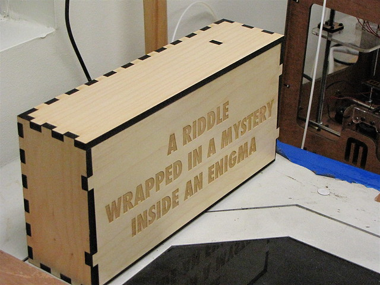

See more pictures of the unveiling [here](http://www.flickr.com/photos/hackrva/sets/72157635841026753)!

At last night’s weekly hack.rva meeting things were progressing as usual. There were some folks in the workroom, soldering irons in hand putting the final touches on their [SpokePOV kits](https://web.archive.org/web/20110809001356/http://www.youtube.com/watch?v=C-kQdN4EoHQ "Spoke POV video") in preparation for the class coming up. Other people were in the conference room checking out some new hardware a member brought in. Out of nowhere the call came. “Hey everyone? You might wanna come in here. There’s something cool about to happen.” At a place like the hackspace where something cool is _always_ happening this sort of announcement gets a lot of raised eyebrows. Interests piqued, all rooms cleared out to the ante room. There stood a new face and lots of [RedBull](https://web.archive.org/web/20110809001356/http://www.redbullusa.com/creation "RedBull").

The newcomer introduced himself as a representative of [RedBull](https://web.archive.org/web/20110809001356/http://www.redbullusa.com/creation "RedBull") who wanted to formally invite hackrva to participate in the [RedBull](https://web.archive.org/web/20110809001356/http://www.redbullusa.com/creation "RedBull") Creation contest. He told us about [RedBull](https://web.archive.org/web/20110809001356/http://www.redbullusa.com/creation "RedBull") working with the hacker / maker community and gave us some, not much detail on the background of the contest. Having delivered his message he had one more thing to give us; a gift. He alluded to the gift being a mystery challenge unto itself.

Armed with this knowledge we eagerly dug into the gift; a small rectangular box wrapped in heavy paper similar to a grocery bag. Inside we found an ornate laser cut wooden box. The top interlocked with the sides like square key teeth in a lock. There was an inscription on top. A grand welcome to a challenge of technical prowess, problem solving, sleuthiness,  as well as trivial knowledge.

We removed the contents of the box and after some soldering, connecting it to a TV,  a computers USB port, and even an original Nintendo Entertainment System controller the gift had us firmly within it’s geeky little grasp.

What secrets did the box hold? What mysteries would we defeat? Come to the next hack.rva weekly meeting to find out. You’ll be amazed.
