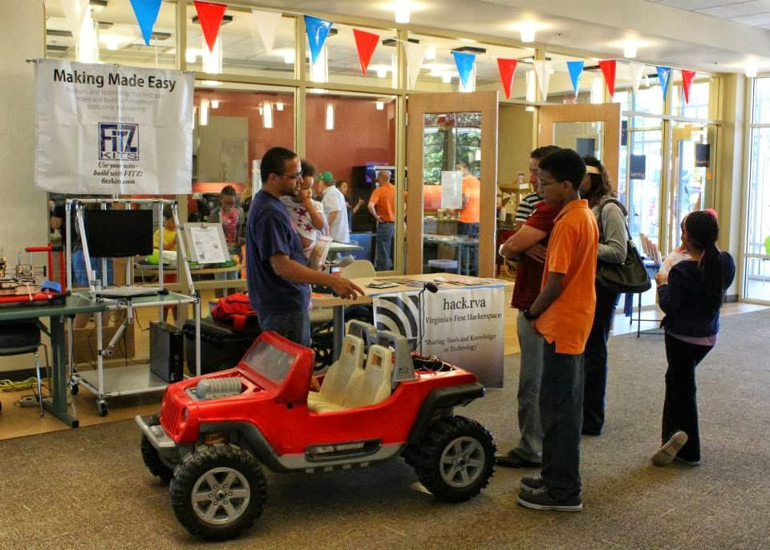

HackRVA participated in the "[Festival of Community Makers](http://www.librarypoint.org/makers)" in Fredericksburg, VA.  We presented our X-Box controller controlled power wheels which was a big hit with kids and adults alike. Also, Mark Fraunfelder gave a talk on maker communities and signed autographs of his new book "[Made By Hand](http://boingboing.net/madebyhand/Made_By_Hand/About_Made_by_Hand.html)". It was a great day of learning about other makers and sharing projects.
