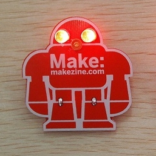

One of our members, Catherine, is having [**Maker Guild**](http://www.rvamakerguild.org/ "Maker Guild") meetings at the space.  Today we taught 8 kids (and some parents) how to solder. We made these cool Make badges with LED eyes. Kids were happy and proud! You can't see it in the picture, but the eyes cycle through a rainbow of colors, but not in sync. We are happy to support the group. They will be the next generation of makers and hackers.
