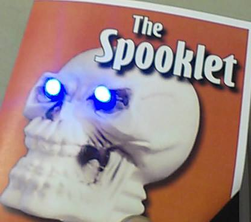
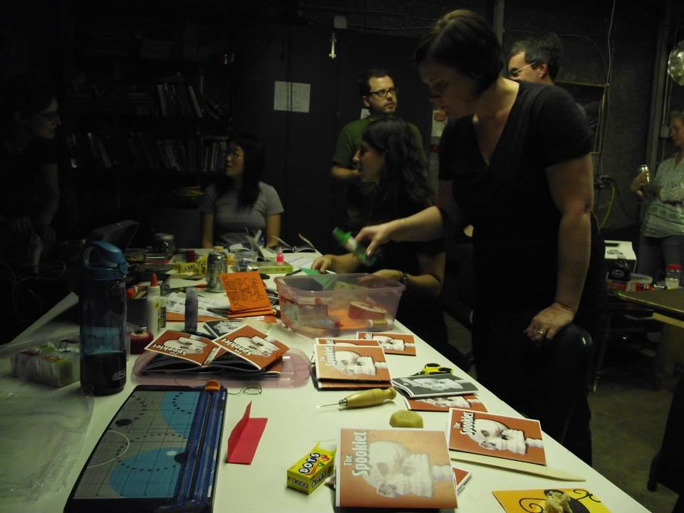

A fun evening had by all at HackRVA assembling the 3rd edition of The Spooklet Zine, a Halloween-themed literary arts publication, which will be featured at the RVA ZineFest in October. In addition to cutting and assembling the zines, we also made special edition copies of The Spooklet with paper circuits and light-up covers. See [The Spooklet Facebook page](https://www.facebook.com/TheSpooklet) for more details about this spooktacular read.

