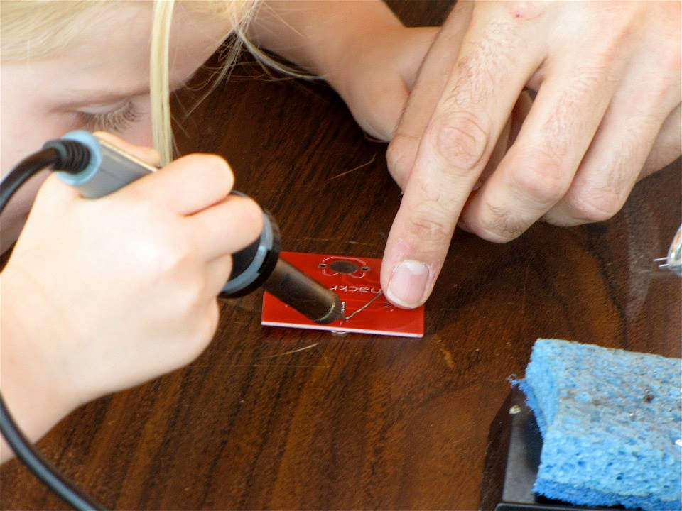

Countless hours of planning, effort, and fretting were poured into the first [RVA Maker Fest](http://rvamakerfest.com/ "RVA MakerFest").  Richmond is a city of festivals, and a city of makers, but there was plenty to do and plenty to worry about in the weeks and days leading up to the event.

We needed to design a board, source the components, find a board house to manufacture them, design and order a banner, plan the physical set up and supplies, and organize our members and volunteers for the day.  After a few close calls, everything was ready and the banner arrived with just two days to spare!

A large portion of the festival was outdoors, and it seemed to be gray and rainy during the entire week.  Soldering can be a challenge at times, but it would be nearly impossible to solder if the irons are all wet!  Luckily, all of the hard work paid off. Nature smiled on us and the clouds parted for an amazing day of sunshine, socializing, showcasing, and soldering!

Our small army had a lot of fun showcasing member projects, chatting about HackRVA’s mission, and teaching the valuable skill of soldering.  The tables were almost perpetually packed once people started filtering out of the science museum into the outdoor area.  We taught over 150 people how to solder, and got to see exuberant pride and excitement as the skill was picked up.

A multitude of other awesome makers came out to share their craft and spread the joy of making.  [Indie Lab](http://indielabrva.com/ "Indie Lab") was busy extracting DNA, [CVBG](http://www.cvbg.org/ "CVBG") had hammers pounding and forges burning, [Maker Guild](http://www.rvamakerguild.org/ "Maker Guild") was creating paper passport booklets.  I met a ton of awesome makers, far more than I could mention here.  You can check them out on the [RVA MakerFest](http://rvamakerfest.com/ "RVA MakerFest") site.

What made this great?  It was the people involved – the dedicated volunteers and expert makers!  Thanks to everyone that made this possible.  Volunteer as an expert maker at the next event or come show off your project during Open House on Thursday nights.  Also, check out the [blinky badge details](http://hackrvamakes.blogspot.com/2014/10/learn-to-solder-badges-for-rva-makerfest.html "Blinky Badge") on the [Maker blog](http://hackrvamakes.blogspot.com/ "HackRVA Makes").

Ok, so maybe it wasn’t legions of new hackers, but the first RVA Maker Fest was a phenomenal event!
