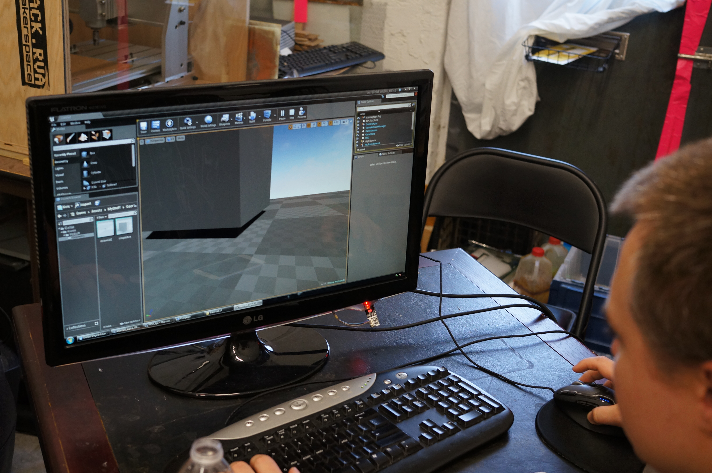
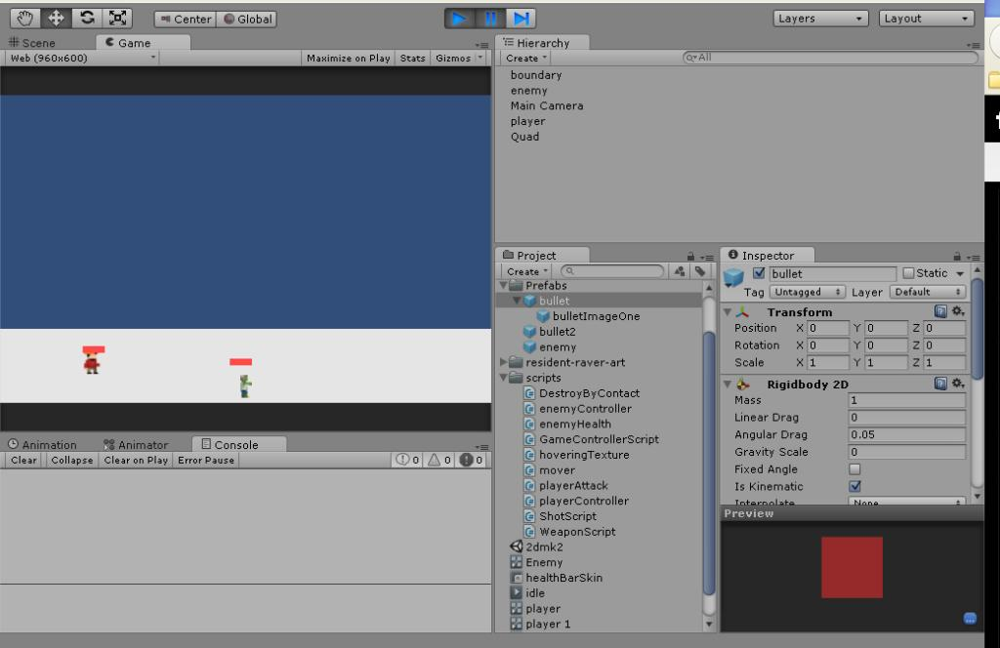

There's been some game making going on around HackRVA. It's messy, strange, and most of us don't really know what we're doing (except Brandon, pictured in Unreal4 Fugue State(TM) in top pic).

But we've been doing it long enough that it's become a thing. The 2 projects in action right now: A Unity based 2D Beat'em Up and an Unreal4 Asteroid Mining Simulator (there's a story there, just ask when you come by, if you dare). 

 If you're interested in game development, double-check the calender(we take the day off sometimes), then feel free to join us at 5pm on Saturdays. It's what we do after we've exhausted the power tools and before we launch into Artimes.
