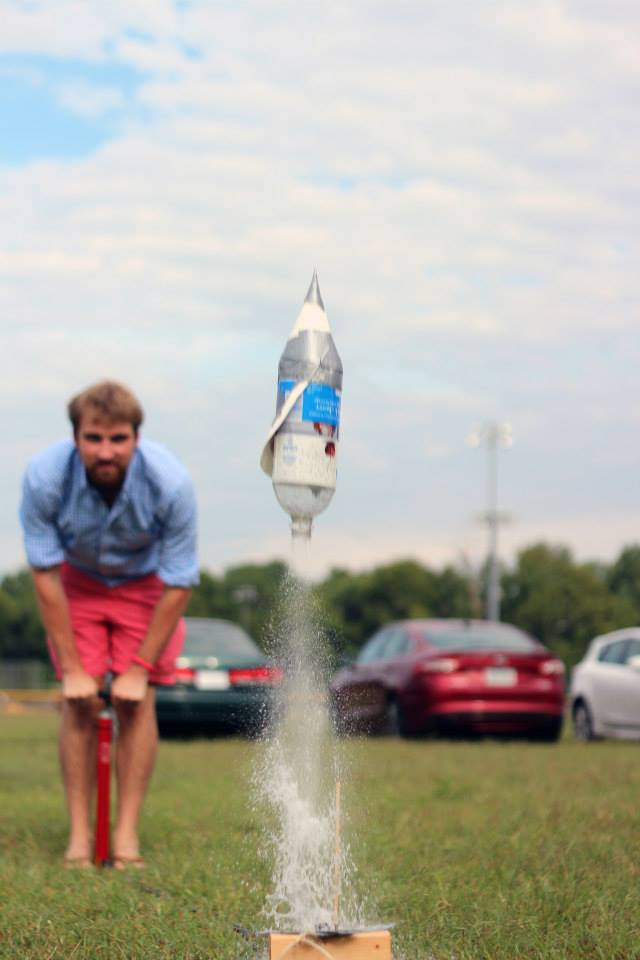

 Indie Lab RVA is bringing independent scientific discovery and experimentation to Richmond. They have recently held two events to inspire and inform. The water bottle rocket launch hangout pictured above, and a [class on electroplating](http://www.meetup.com/HackRVA-Meetup/events/219060477/).

They also have an upcoming event [DNA Extraction](http://www.meetup.com/HackRVA-Meetup/events/219060541/), just click that link to sign up.

Indie Lab RVA currently resides at HackRVA while they hunt down a space dedicated primarily  to science. In the mean time, HackRVA has been happy to have them as members as open science, opensource, open hardware, and making are all of a kindred spirit.

To learn more about Indie Lab, visit their [website here](http://indielabrva.com/?page_id=18), and join their [facebook here](https://www.facebook.com/indielabrva?fref=photo).
