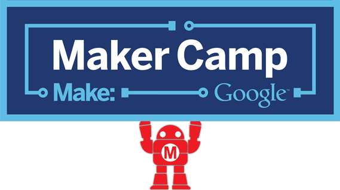
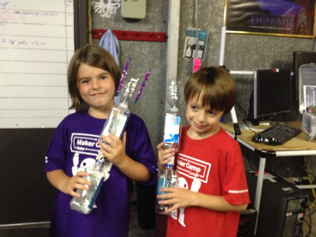

[Maker Camp](http://makercamp.com/) is underway at HackRVA!

We've already made Makey Robots, Heron's Fountains, jaunty caps, LED throwies, animals with eyes that light up, making our own games, lots of hot glue, paper craft, sculpting, and lots of smiles.

Three events completed and there are still four to go!

Visit the RVA Maker Guild's [Meetup](http://www.meetup.com/RVA-Maker-Guild/) to participate in RVA Maker Camp events. And learn more about Maker Camp at the [RVA Maker Guild website.](http://www.rvamakerguild.org/)

SO MUCH FUN!

