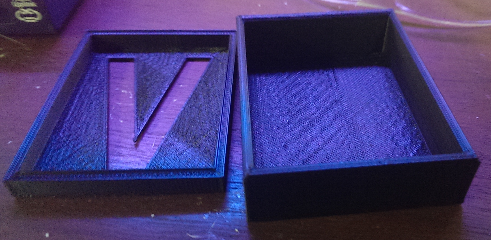

We learned some CAD last Saturday using Autodesk Design 123D. The pic above is a custom box that was designed in CAD and printed out on the HackRVA 3D printer by a total beginner. He drew it from scratch and did a crash course in 3D printing in about 2 hours.

I give the 123D software decent marks. It's a step up from tinkercad, but not as powerful as a full commercial CAD package. Still a solid free offering from Autodesk to the maker community.

We're looking at some other software options such as open source FreeCAD or maybe using full AutoCAD for the next class. We'd like to see more of our maker community empowered with the ability to draw their own designs, and ultimately 3D print, laser cut, or CNC their inventions.

Watch our Meetup page for future classes and events!

