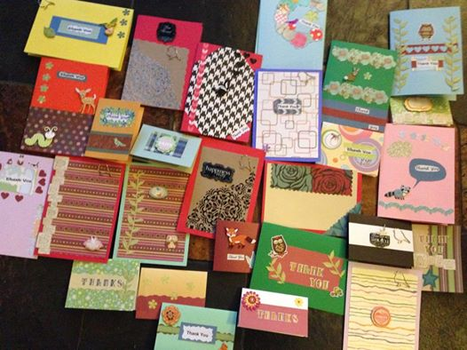

HackRVA came together for a good cause last Saturday.  [HandsOn Greater Richmond](http://www.handsonrva.org "HandOn") sent out a call for makers to benefit [NAMI](http://www.nami.org "NAMI"); we heard the call and responded!

We made stress-balls out of (2) balloons cut down and little sacks of rice. We also made Thank You cards and Thinking of You cards. It was a fun and relaxing morning of crafting, coffee, and bagels. We even had a few walk in participants.

[More pictures](https://www.flickr.com/photos/hackrva/sets/72157645087595421/ "More pictures") are on Flickr.
