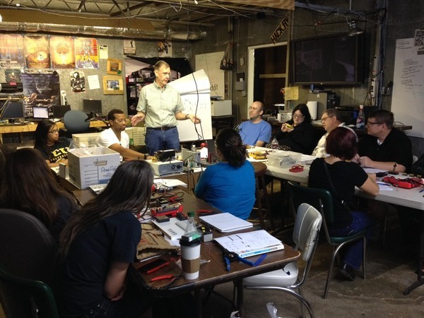

For June HackRVA held an awesome Electronics 101 Workshop in the Maker Workshop Series.  Our instructor, Eric brought enough demonstrative gear and enthusiasm to keep Richmond lit up for a week!

See more pics here.

And join the HackRVA Meetup for updates, because Eric's planning on doing more of these!

