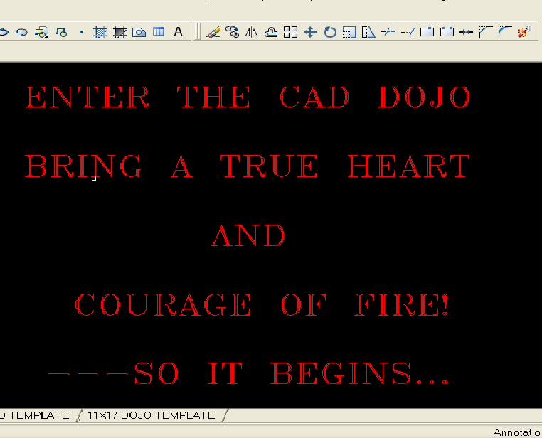
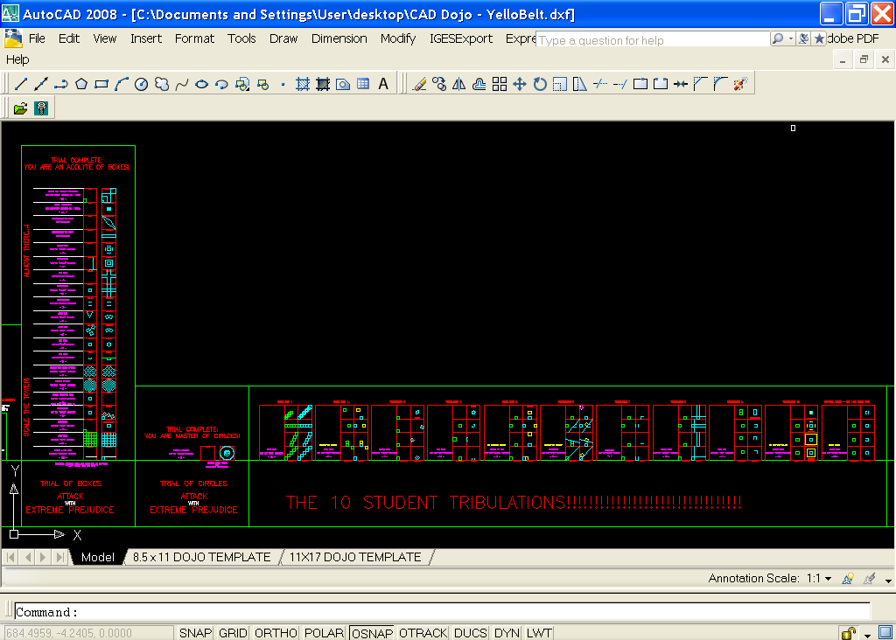

HackRVA trained beginners of AutoCAD in the CAD Dojo.  The CAD Dojo uses repetition and scaffolding in a video-game inspired level system to drill students on common commands for drawing in AutoCAD.

This method forgoes the stickier parts of the UI and broad explanation of the AutoCAD environment, instead focusing on students drawing straightaway. After surviving the grueling trials of the Dojo, they can leverage the power of the internet or youtube tutorials to learn the UI and particular aspects of AutoCAD as needed.

The [file linked here](http://www.thingiverse.com/thing:536371) is the Dojo training regimen self-contained in a single DXF file. Brave students can download and start the "Trial of Boxes", then move on to the "10 Student Tribulations", picking up valuable CAD skills along the way in this "game-a-fied" take on CAD training.

Our goal is to give makers more power to design and eventually create their own things by taking CAD drawings and translating them into G-Code for tools like the HackRVA 3D Printer, Laser Cutter, and CNC Router.

To stay tuned for more workshops in our monthly maker series, [join our Meetup page](http://www.meetup.com/HackRVA-Meetup/) where we announce HackRVA events.

