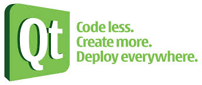

Let it be known! A serious amount of non-traditional learning has occurred at HackRVA this year and continues to go on!

I've most recently been attending Jonathon's amazing [QT C++/Frameworks](http://qt-project.org/downloads) class. It's the closest thing that I've seen to an actual free college class (not online video, real meatspace instruction!), and yet is much more relaxed and bi-directional than a traditional classroom with the student and teacher (in this case, the teacher being hackrva member and  friend, Jon, who goes beyond the pale to answer questions beginner and advanced... it's really amazing to see the amount of diversity in conversation to "what is a 'for loop' " to "what is the underlying infrastructure of that function").

The QT class or meeting group or hangout (depends on what you want to call it) has been going on for over a month with at least 7 members involved. Teacher Jon's overall goal is to give people the power to code, make apps, and possibly create a community of open source developers than can collaborate on a meaningful project through hackrva.

Though this is the latest and greatest effort at hack to find a way towards non-traditional learning in the community, there have been others. Kramer ran two different open courseware groups over the spring and summer. A CCNA study group produced two qualified persons ready to move up in their profession. And there's the monthly hackrva workshops that have given introductory skills to many a maker and hacker in the Richmond community.

HackRVA is a member funded and member run organization. Thanks to all those teachers that keep "hacking" toward independent learning and to those that attend to put there best foot forward to learn.
