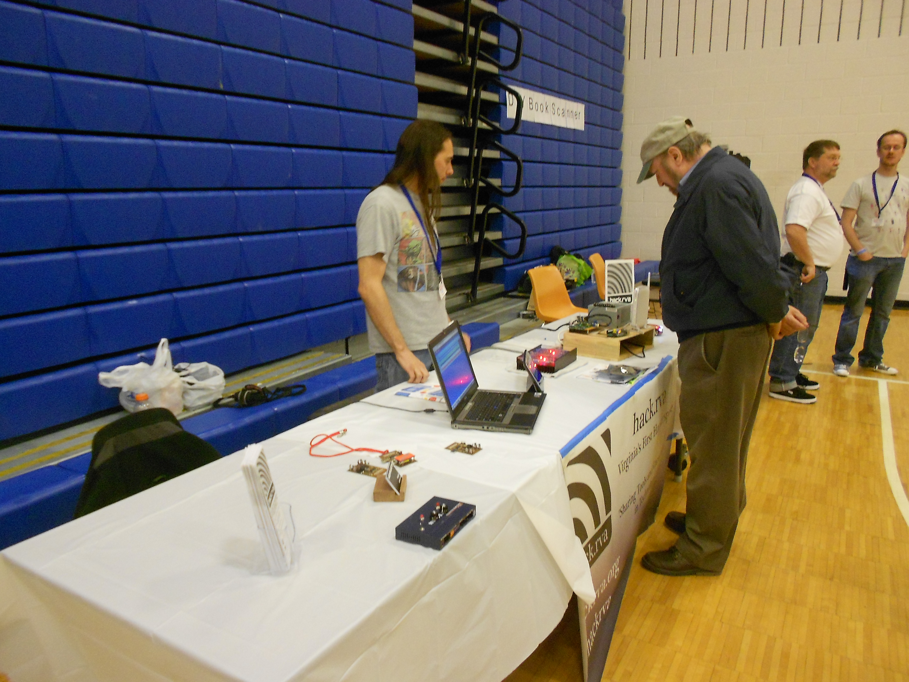

 We had a great time at the [NoVa Mini Maker Faire](http://makerfairenova.com/)!  There was plenty to see and do with over 100 makers featuring a wide variety of exhibits.  Nearly 4,000 people attended and the venue was packed wall to wall.

Our table was busy during the entire event (and even after the event ended!) spreading the mission of our makerspace and showcasing a few projects we've created.

Enthusiasm for science, technology and making is really taking off!  If you're looking for more events, check out the [Mini Maker Faire](http://makerfairegreenbelt.com/) in Greenbelt, MD, the [USA Science Festival](http://www.usasciencefestival.org/), and [TEDxRVA](http://www.tedxrva.com/).
