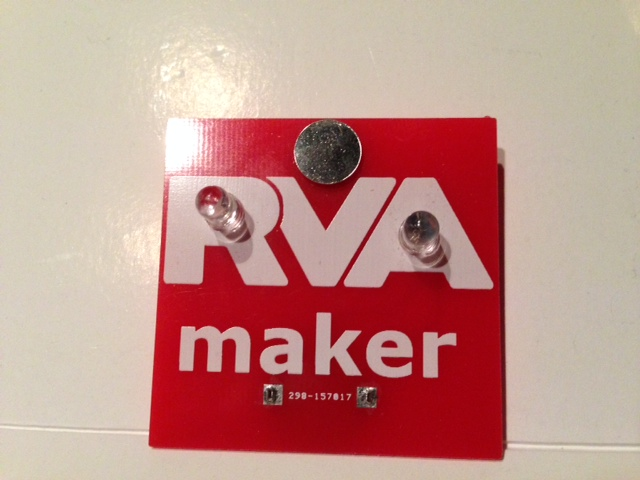
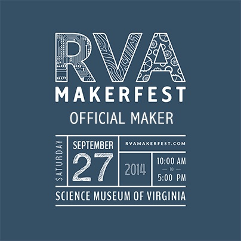

We're teaching Richmond to solder at the upcoming [RVA Makerfest](http://rvamakerfest.com/)!

Pictured above is the custom "blinky badge" designed by HackRVA. We'll be using it to teach makers of all ages the wonderful art of soldering. And they'll get a sweet blinking "flair" for their effort.

The RVA Makerfest is at the Richmond Science Museum on Saturday September 27th, and is free to attend. See you at the event!

