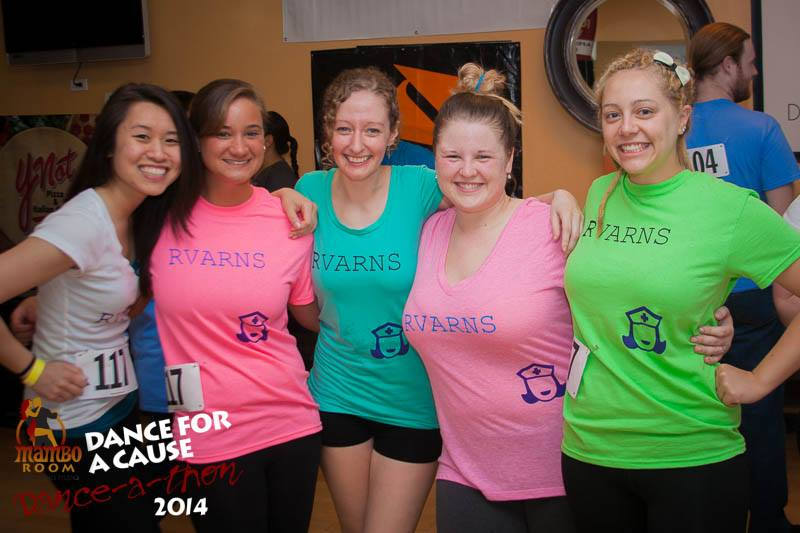
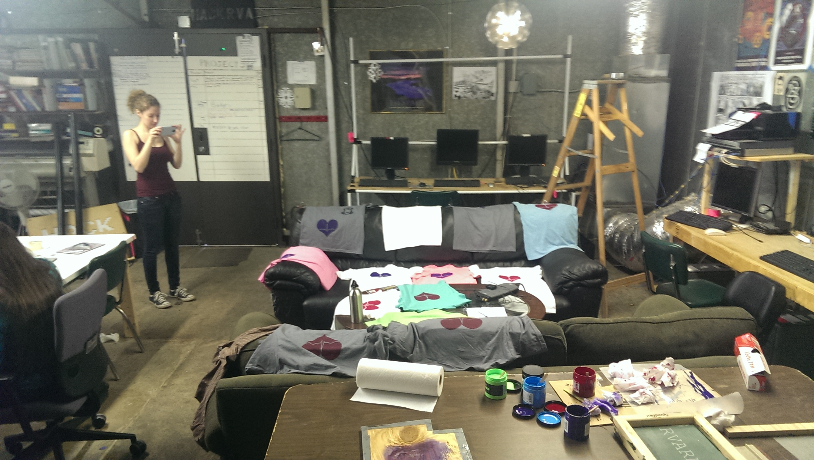
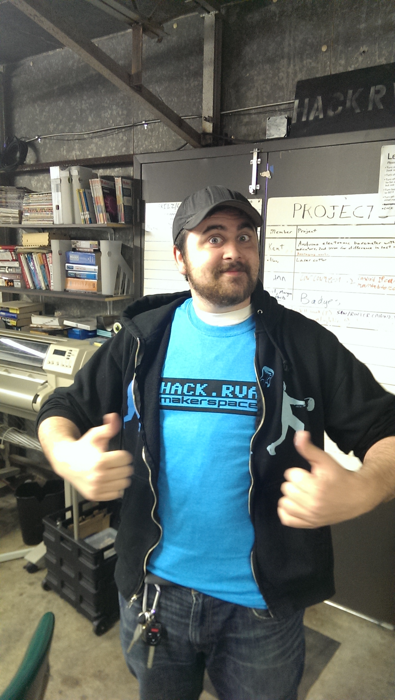

Dustin and a few others helped make these cool shirts for the RVA RNs using our new screen printing abilities. The RVA RNs (Registered Nurses) are wearing them for today's [Dance-A-Thon "Dance For a Cause" event](http://mamboroomdance.com/danceathon/watchus.html). That's right, DANCEATHON -> 12 hours of dancing. Sounds awesome right!

Btw, we've been making HackRVA shirts too, so if you want one, just bring a blank shirt during an open house and we'll print one.

 
