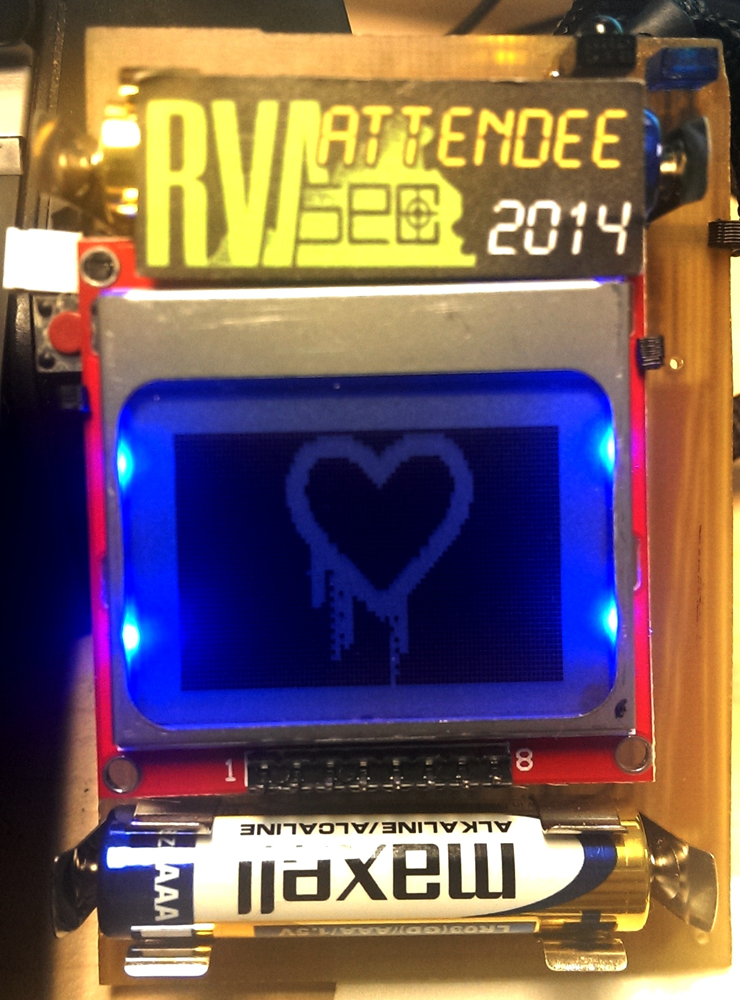
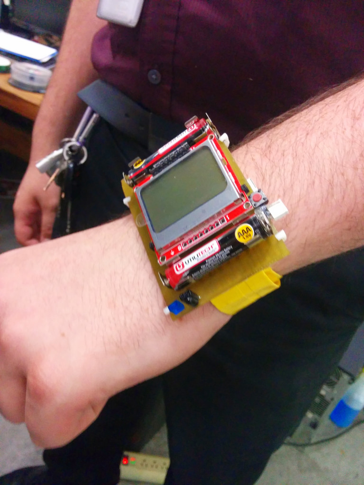
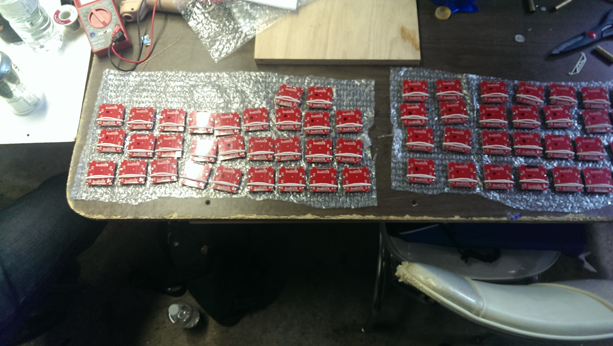

The RVAsec Badge 2014 is complete!

[RVA Security Conference](http://rvasec.com/) goers thoroughly enjoyed their badges which you can read about in more technical depth on our [wiki here](http://www.hackrva.org/wiki/index.php?title=RVAsec_Badge_Build_2014) and [GitHub here](https://github.com/HackRVA/rvasec-badge-2014). We made 300 of them over several months of sustained effort.

The "Badge Build" has become the preeminent annual group project at HackRVA offering an array of challenges from circuit board design and manufacture, to coding, to how to work together on a large scale project.

We're super proud of this creation. We've improved on our capabilities each year while simultaneously expanding the scope of the project itself. We're already looking ahead to next year, so stay tuned for upcoming badge related events.

In the meantime, here's [some photos](https://www.flickr.com/photos/hackrva/sets/72157644260250204/) from our odessey!

