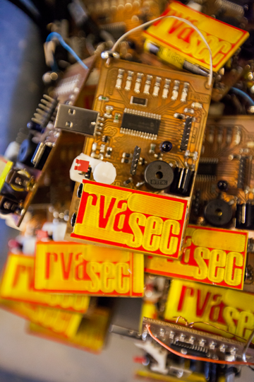

The badge build for the RVAsec Richmond Security conference is underway. This will be the third year HackRVA has created badges for the conference.

For a really nice preview about the badges, check out this QandA with HackRVA member Morgan Stuart on the RVAsec blog.

We did some group soldering of speakers in a recent preliminary session. More opportunities for HackRVA members to contribute, build, and solder will be coming soon as plans materialize. Watch the calender and mailing list. 

