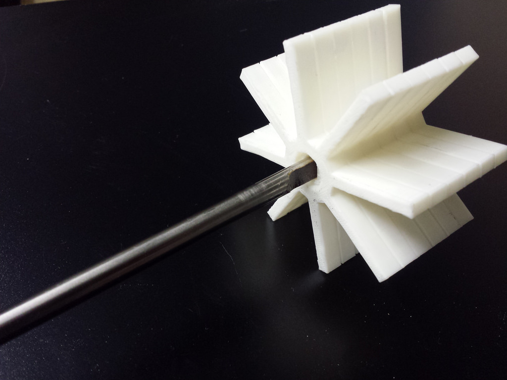
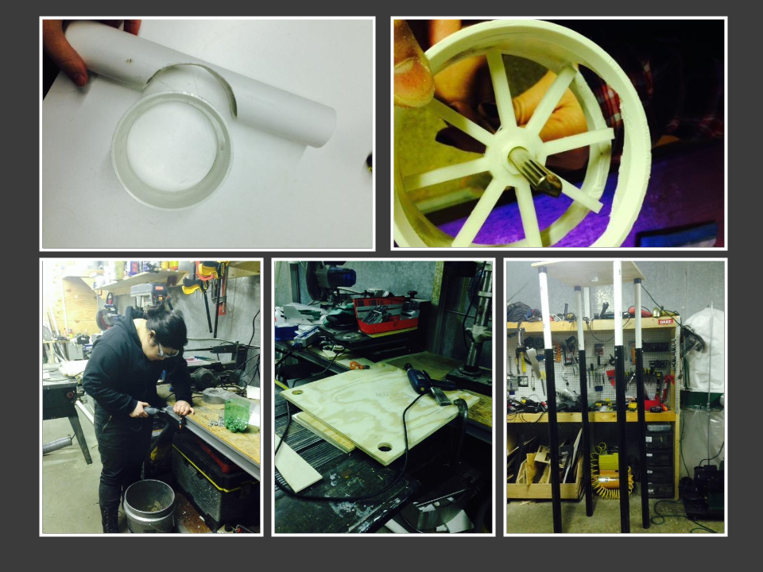

Marian and Shelly are about the busiest people I've met in a long time. In addition to being engineering students at VCU, they hang out at HackRVA for the fun of making things, and do numerous IEEE related event's throughout the year. 

 Pictured above are results from the hydro power demo that they built primarily at the space through 3D printing and various traditional fab techniques.

Here's a slide review of their year as student leaders in IEEE. They've also been major contributors to this years badge build and to general improvements around the space such as workbench creation and welder upkeep.

It's this kind of enthusiasm and commitment to community that keeps places like HackRVA awesome!

