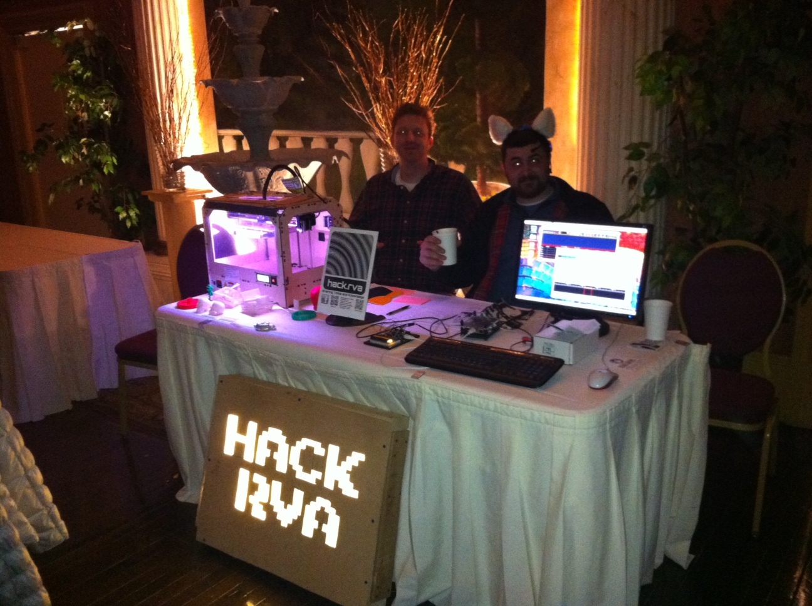

We spread the word about 3D printing, maker technology, and makerspaces at the recent [WRIR Birthday "Party for the Rest of Us](http://wrir.org/index.php?/blog/entry/12522/). Rob presented his ["Beagle Brick" project](http://hackrvamakes.blogspot.com/2013/12/beaglebrick-sdr-ham-radio-station.html) and we had an arduino project to share as well. Independent radio enthusiasts really enjoyed the spectacle of 3D printing as well as talking about all things hackerdom. We saw a lot of great acts and some wowed faces that came by our table. Thanks for the food and festivities WRIR! Go Richmond and Independent Radio!

For more pics, [go here](http://www.flickr.com/photos/hackrva/sets/72157640704597225/). And btw, those aren't just cat ears, [they read brain waves](http://neurowear.com/projects_detail/necomimi.html#ShopList)  : ) .
