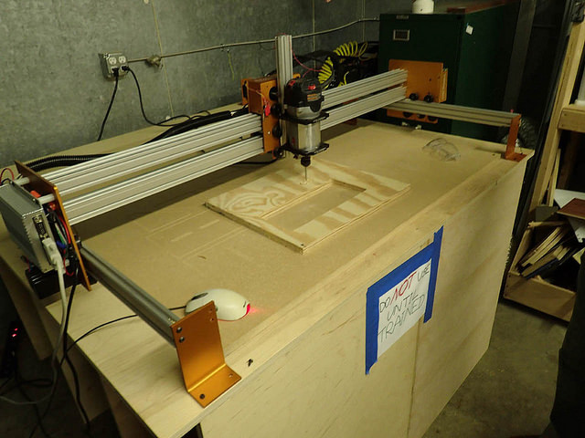

<!--  -->

Our [CNC Router Crowdfund](https://www.indiegogo.com/projects/cnc-router-for-hackrva) and build-out has been a great success!

Since installing we've used it to create many [cool projects](https://www.flickr.com/photos/hackrva/sets/72157649947029027/) and [trained HackRVA members](http://www.meetup.com/HackRVA-Meetup/events/219756047/) CAD/CAM techniques to use the CNC. We've also created a [wiki guide](http://www.hackrva.org/wiki/index.php?title=CNC_Mogul_Router) for its use.

Here's a link for more [pics of the tool itself](https://www.flickr.com/photos/hackrva/sets/72157645798695112/). And here's a [link to videos](https://www.youtube.com/playlist?list=PLU8T7ojvmv5ODKpdMP6SqMbg0Ee7hHdDo) of the CNC in action.
