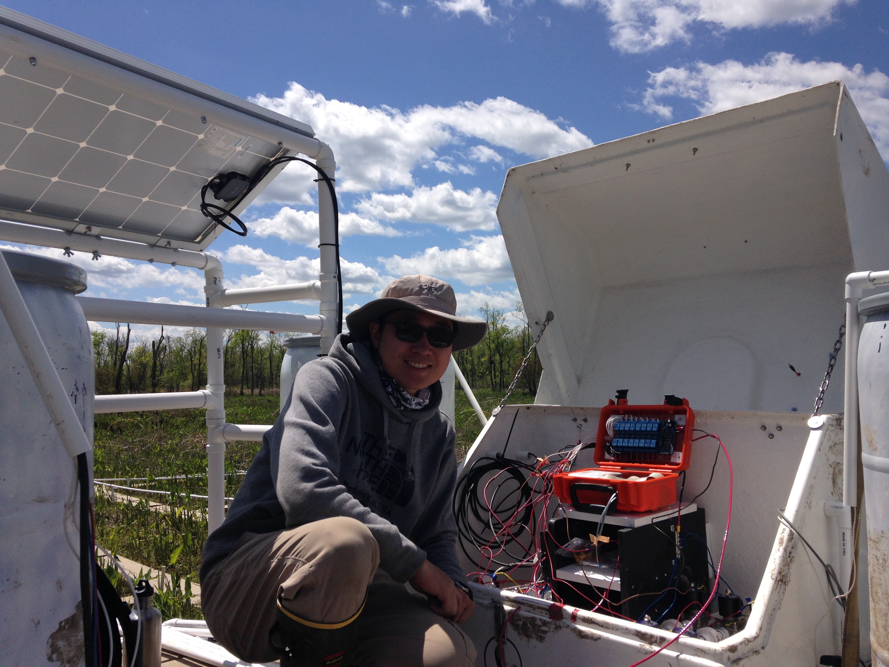

This project is brought to you by HackRVA member and VCU scientist Dong Yoon (Daniel) Lee along with his colleagues. The project simulates the effects of saltwater intrusion due to sea level rise on tidal freshwater wetlands using a solar-powered automated saltwater pumping system.

I'll leave the details of the project to other sources, they're covered much better at the [project facebook page](https://www.facebook.com/TFwetland?fref=photo) and build list [here on the HackRVA wiki](http://www.hackrva.org/wiki/index.php?title=Impacts_of_Sea_Water_Level_Rise_on_Wetlands). But I do submit this as an example of our open community, shared tools, and space at work.

Daniel started this project with some general concepts, but he was a novice maker when it came to the mechanical and electrical/control systems required to bring his vision to life.

Many space members lent hands and brains to assist in the building of this project over the course of several months; from arduino trouble shooting, to donating spare parts, to advice on pump systems.

See more [project pics here](https://www.flickr.com/photos/hackrva/sets/72157653342733329/with/17678179514/) with some system breakdown description.
