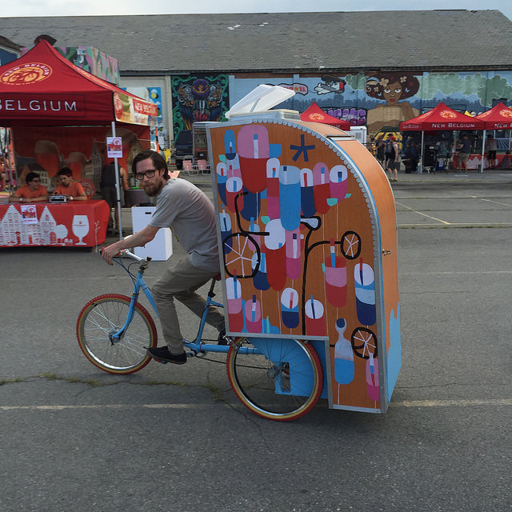
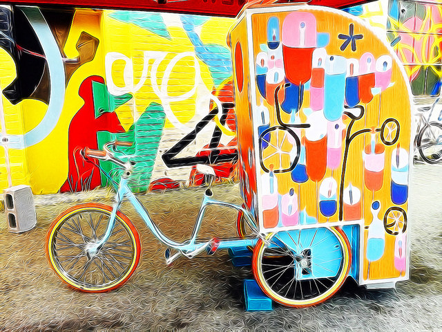

Bicycle Y'all was built built by HackRVA member Jay-Michael. JM also works with the podcast [Secretly Yall](http://www.secretlyall.com/), a Richmond produced story telling podcast. JM being the crazy maker/hacker he decided to build a bike with a story telling booth on back; complete with microphone, recording device, and mobile anonymity. Check out more details about the project [here](http://https://www.kickstarter.com/projects/1409999367/bicycle-yall/description), and see [more pics here](https://www.flickr.com/photos/hackrva/albums/72157657393271168/with/20917149261/).

