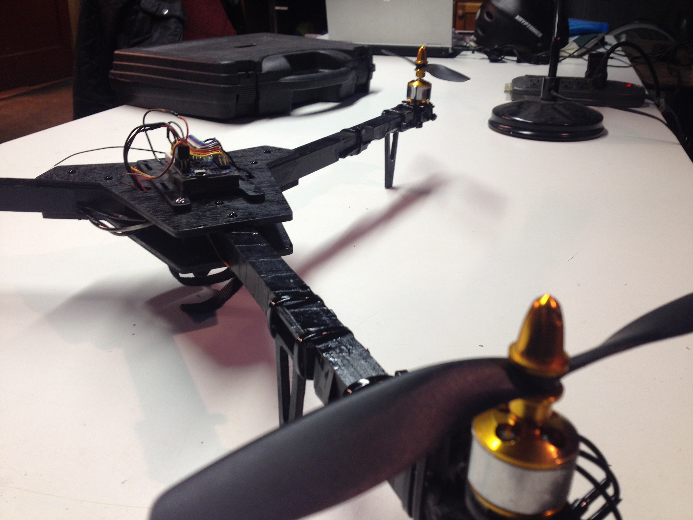

HackRVA starts a new special interest group and monthly meeting for taking to the air.

It shall be known as "Flight Night"!

Thomas sez: Flight Night will provide an opportunity for HackRVA members and non-members to meet with other individuals interested in things that fly.  While there will be a focus on multi-rotor drones; tricopters, quadcopters, etc, this un-moderated event will be open to any type of un-manned flying vehicles including R/C aircraft, and model rockets.

If you have something that you have been working on and would like to bring it to show off to others, or have something that you built and can't figure out how to fix it, or have dreamed of building a drone but didn't know how to get started, then this event is for you.

Check the [HackRVA Meetup page](http://www.meetup.com/HackRVA-Meetup/) for details for the next FLIGHT NIGHT!
