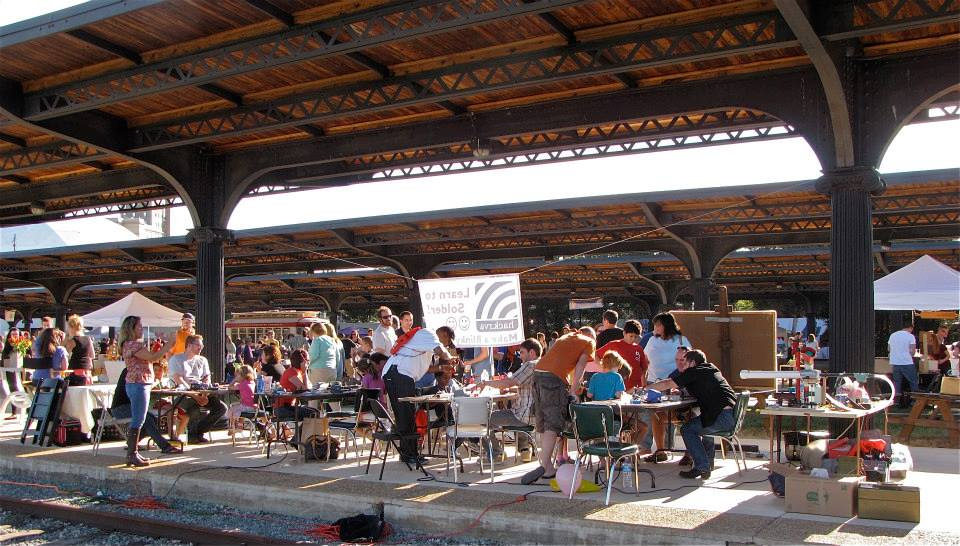

2014 was a great year at HackRVA. Here's a list of some things that happened!

**Community:** - Documented almost [70 creations on our project blog](http://hackrvamakes.blogspot.com/) - [Crowdfunded](https://www.indiegogo.com/projects/cnc-router-for-hackrva), installed, and trained for CNC Router - Completed [laser build](https://computationalphysmatronics.wordpress.com/category/projects/2-x-laser-build/) (ok, last little bit) - Educated young Makers through [Maker Guild](http://www.rvamakerguild.org/), Maker Camp, and Lego Leauge - End-to-end designed, produced, and delivered [350 boards for RVAsec](http://rvasec.com/rvas3c-badge-preview/) - Taught several hundred people to solder at [RVA Maker Fest](http://rvamakerfest.com/) - Upgraded our [fab lab with additional tools](http://www.hackrva.org/wiki/index.php?title=Equipment), organization, and mobility - Assisted [Indie Lab RVA](https://www.facebook.com/indielabrva) in establishing an open science initiative - Played [epic games](https://www.flickr.com/photos/hackrva/15942669489/) of Cards Against Humanity - Crashed a lot of [Artemis ships](https://www.flickr.com/photos/hackrva/sets/72157644801464849/) with custom lighting. - Contributed handmade goods to [Makers in the Community](http://www.meetup.com/HackRVA-Meetup/events/189280522/) program - Started [monthly workshops](http://www.meetup.com/HackRVA-Meetup/events/220102611/) for teaching people new things: (Solder, Electronics, Wearables, CAD, Blender, Arduino, 3D Printing) - So many other things that they can't all be listed ([photos](https://www.flickr.com/photos/hackrva))!

**Organizational:** - Established HackRVA as a [non-profit](http://www.hackrva.org/blog/about/) - Improved giving tours to potential new members - Created a new website - Revamped the [wiki](http://www.hackrva.org/wiki/index.php?title=Special:AllPages). (a thousand or so wiki edits ) - Created more organization around [volunteering](http://www.hackrva.org/wiki/index.php?title=Getting_Involved) - Improved our [membership](http://www.hackrva.org/wiki/index.php?title=Terms_and_Conditions#Becoming_a_Member) payment experience - Reached our first phase [budget goals](http://www.hackrva.org/wiki/index.php?title=Financial_Reports) ahead of schedule - Reached and exceeded member target goal of 80 members - Created [donation infrastructure](http://www.hackrva.org/wiki/index.php?title=Terms_and_Conditions#Donating) and opportunities - Established clearer [membership guidelines](http://www.hackrva.org/wiki/index.php?title=Terms_and_Conditions#Membership_Guidelines) - Improved/Simplified network infrastructure - Installed a [fabulous door](http://hackrvamakes.blogspot.com/2014/12/fab-lab-gets-facelift-sign-and-door.html) - Created a [Digital Design Station](http://www.hackrva.org/wiki/index.php?title=Digital_Design_Workstation)

**Some Goals for 2015:** - More projects! - Enter an Instructables contest as a group - Create a nicely documented open build project - Get a project on Hack-a-Day ([done](http://hackaday.com/tag/baby-namer/)) - Continue with Equipment Upgrades - Continue with Monthly Workshops - Build Group Projects - More of what happened in 2014!
