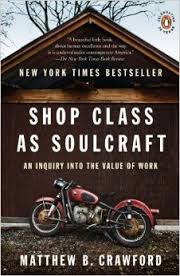
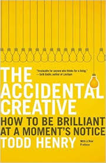

 

HackRVA now has a book club. We meet at the VMFA and read maker and creative related books. Our first book was "The Accidental Creative." There was a lot of guidance and discussion on how to be more productive as well as, you guessed it, creative. Now we're reading "Shop Class as Soulcraft". This one is all about the value of doing stuff with your hands. Its also examination of cultural perspective on physical work vs knowledge work.

To join in on our book club got to [our meetup page here](http://www.meetup.com/HackRVA-Meetup/events/222280212/).
