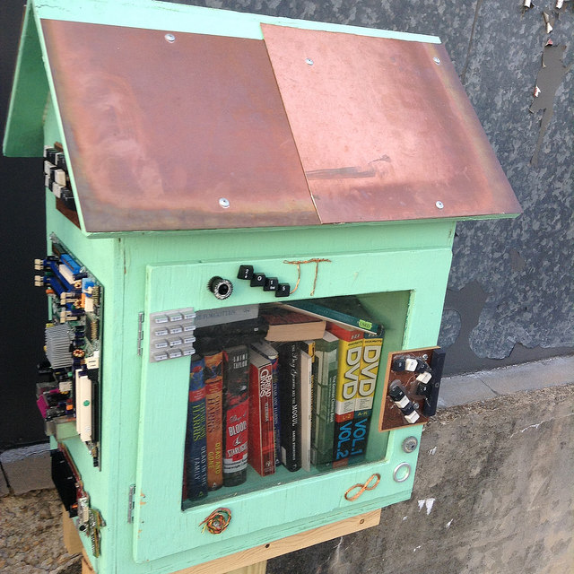

HackRVA along with [RVA Maker Guild](http://www.rvamakerguild.org/) created the Little Free Library outside the space. We're internationally [listed here](http://littlefreelibrary.org/ourmap/).

Little Free Libraries are a variation on a tried and true concept of "Take a book, leave a book." Books are free for anyone to take and read. Or you can leave books for others. No strings attached! So come by and take our books. Please, we have so many!
