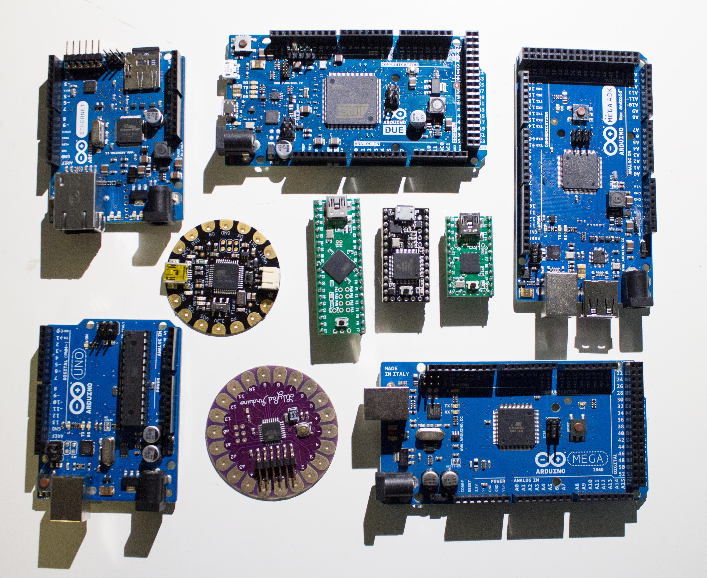

Microcontroller Monday has been one of our biggest hits lately. It's a monthly event that focuses on the use of those magic little boards that power so many projects.  Lot of people, lot of fun, lot of electronics.

Event host, Thomas sez:

"Microcontrollers are a great way to get started in electronics.  There are so many things that you can do with them.  To begin with, you can control servos, drive stepper motors, turn things on and off, and later work your way up to attaching a screen and playing games on them.  If you have something that you have been working on and would like to bring it to show off to others, or are new to microcontrollers and want to know how to get started, then this event is for you."

Check out the [HackRVA Meetup page](http://www.meetup.com/HackRVA-Meetup/) to find out about the next event.
