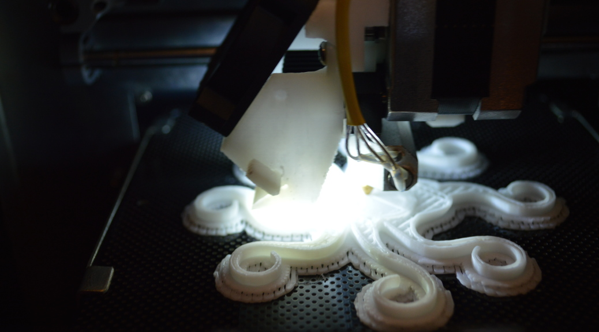

HackRVA members Andrew and Chris from [RepTechRVA](http://reptechrva.com/) / [CarryTheWhat](https://www.etsy.com/shop/CarryTheWhat) taught this great workshop on 3D printing. Attendant makers learned the ins-n-outs of different machines, material types, and troubleshooting printers.
