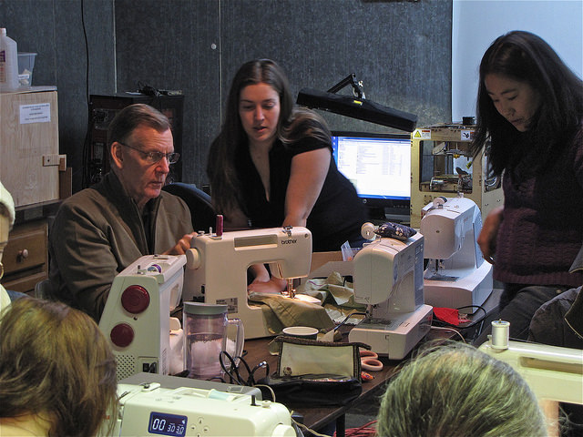

February was all about sewing thanks to this [RVA Women of Hack](http://www.meetup.com/WoHack/) sponsored workshop.

Whether you wanted to create something from textiles for the first time or were highly fascinated by the mechanical wonder that is a sewing machine and how to fix it, all were overjoyed. People brought in their machines and got to stitching. Many owned a machine but didn't know much about it. Others were well versed and helped the newbies. We even had a heavy duty machine donated.

This was a high energy event! Lots of people, machines, music, and fun!

Also, at least two original concepts were attempted - a shop-skirt and a vulcan-glove.  For more events like this, join the [HackRVA Meetup](http://www.meetup.com/HackRVA-Meetup/).

Check out more pics [here](https://www.flickr.com/photos/hackrva/sets/72157648952671544/).
