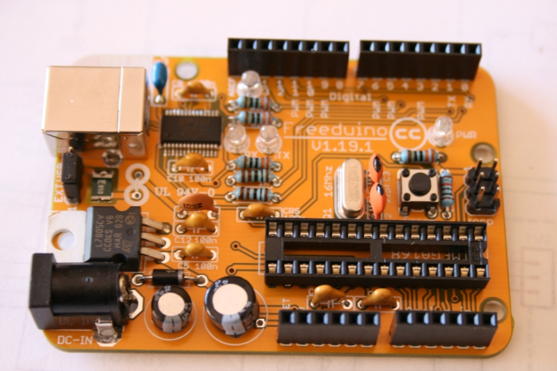

This is isn't your grandad's soldering class. These makers not only learned to solder, but they did it by building a complete working Arduino. The Freeduino kit was the perfect intro to soldering projects. Plus its a gateway to Arduino itself. Workshop attendees learned about different types of solder wire, how to apply it, solder suckers, temperature control, and trouble shooting. This was a phenomenal workshop. One of our members eloquently captured his experience on our [project blog here](http://hackrvamakes.blogspot.com/2015/04/arduino-freeduino-what-do-we-know.html).

Keep your eyes open for more workshops like this over at [our meetup page](http://www.meetup.com/HackRVA-Meetup/).
