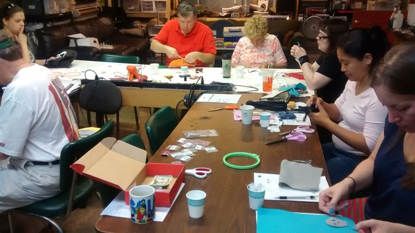

Make those textiles blink, yo! HackRVA held another sweet wearables workshop, this time hosted by Melanie. She sez:

Everything looks better with a LED (or two). In this workshop, you'll learn how to create a basic circuit using a battery, conductive thread, and LEDs.

More [pics here](https://www.flickr.com/photos/hackrva/albums/72157659070645305). Watch our meetup for more cool events like this.
