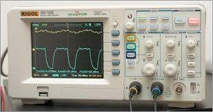

Oscilloscopes are one of the fundamental tools on an elecontroncis workbench. At HackRVA we introduced the use of the tool and re-familiarized those that were rusty. We have two "O-scopes" at the space with all the fixings. Another one of [these workshops](http://www.meetup.com/HackRVA-Meetup/events/222330458/) is coming soon, so keep tabs on our meetup page for the next event.
