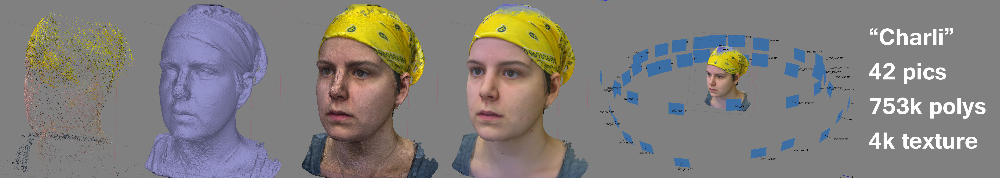

Do you know your "point clouds" from your "alpha channel"? Well we do now thanks to [Grey](https://greyhash.artstation.com/)'s [Introduction to Photogrammetty Photoscan workshop](http://www.meetup.com/HackRVA-Meetup/events/227124355/)! We tried doing a [Silver Surfer figure outside](https://www.flickr.com/photos/hackrva/albums/72157662029666379/with/23827518722), but the light was too much. So, we took a pile of pictures of Charli's head instead. Those pics get loaded up into Agisoft and processed. To go even further we used Z-brush to do more cleanup. Here's a link to the [tutorial info](https://docs.google.com/document/d/1DqXKd7y6L-GWA9I-QW5i-CV1OYMpout2kGOl2cNx8YY/edit?pref=2&pli=1).

[Here](http://greyhash.blogspot.com) [are](https://greyhash.artstation.com/) [some links](http://drawcrowd.com/greyother) to Grey's work, and below a little video to get the full effect of the scan.

\[video width="480" height="480" mp4="http://www.hackrva.org/blog/wp-content/uploads/2015/12/23905785806\_288p.mp4"\]\[/video\]
