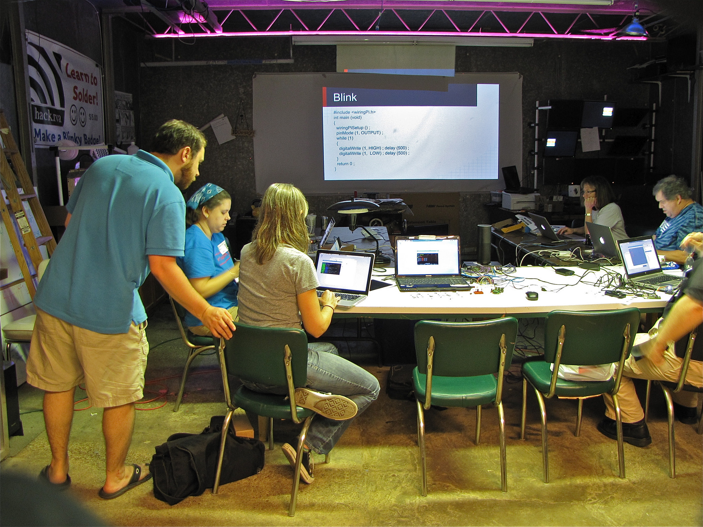
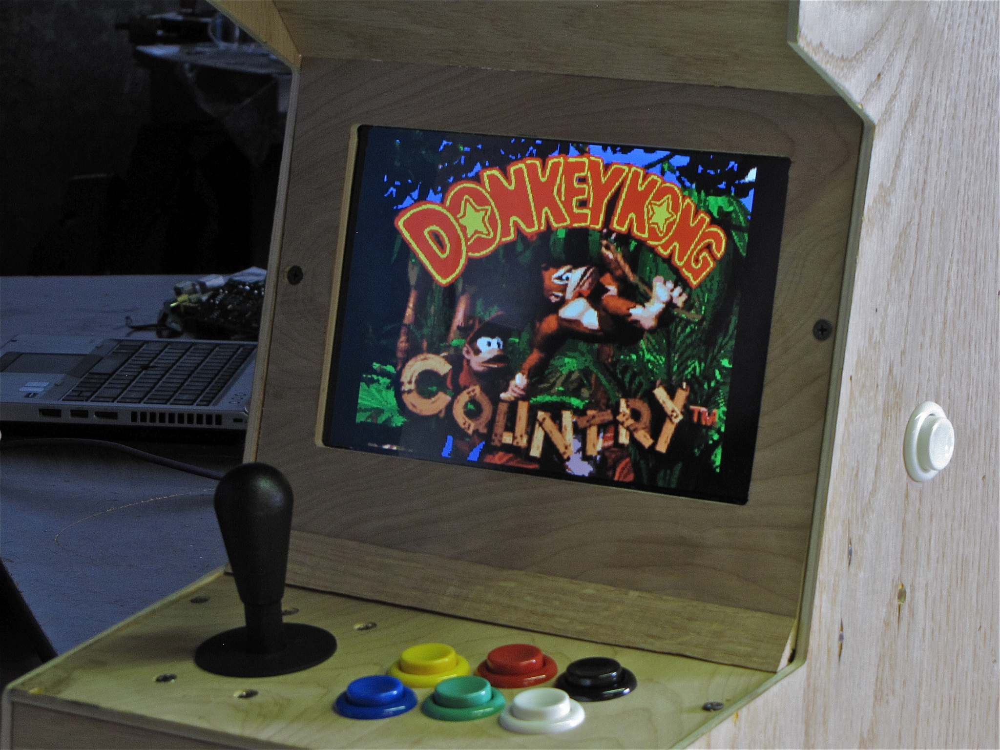

[Raspberry Pi](https://www.raspberrypi.org/) is a pocket sized computer for around $30. We learned to load an operating system and write code for using the GPIO.

Here's [a link to the wiki entry for the class](http://www.hackrva.org/wiki/index.php?title=Introduction_to_Raspberry_Pi_Workshop), including the slideshow used in the class.

\[caption id="attachment\_790" align="alignnone" width="640"\] r-piCade - a small arcade custom built at HackRVA using raspberry pi\[/caption\]
