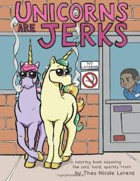
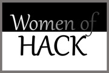
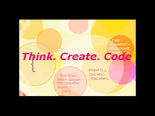
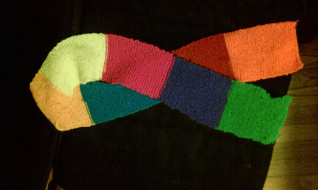

  

Whether [coding](http://www.meetup.com/WoHack/events/222311582/), [coloring](http://www.meetup.com/WoHack/events/221939926/), [knitting](http://www.meetup.com/WoHack/events/221939285/), or hacking [robotic teapots](http://www.meetup.com/WoHack/events/221480251/), the RVA Women of Hack are in full swing. [Their meetup](http://www.meetup.com/WoHack/) is full of diverse events for all variety of making interests. Come out and join this dynamic group of makers for fun and learning.

 
