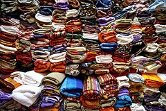
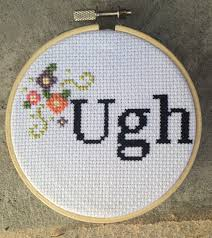

There's one heck of a knitting contingent at HackRVA. They've knitted piles of scarves, bird's nests, and at least one pair of socks. They meet everywhere from the park, to coffee houses, to HackRVA itself. If you're interested in the fiber arts or clicking some needles together, check the [HackRVA meetup page](http://www.meetup.com/HackRVA-Meetup/) for the next event.

Oh, and they've been known to cross stitch too.

