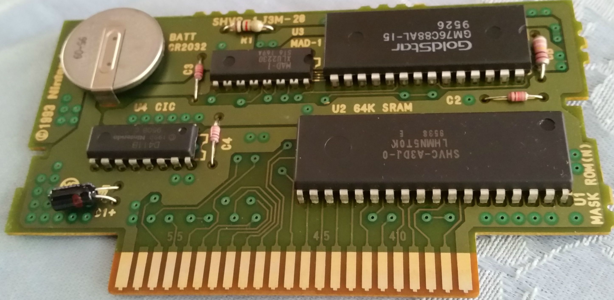

We spent the day soldering, desoldering, programming, and testing [SNES reproduction carts](http://www.meetup.com/HackRVA-Meetup/events/226576367/). It was a good opportunity get the small-run of electronics making experience - especially for those thinking about taking an electronics product to market. People also leveled-up their soldering skillz in general. And here are [some notes](http://www.hackrva.org/wiki/index.php?title=PCB_Assembly_Bootcamp) on PCB making from HackRVA wiki.
