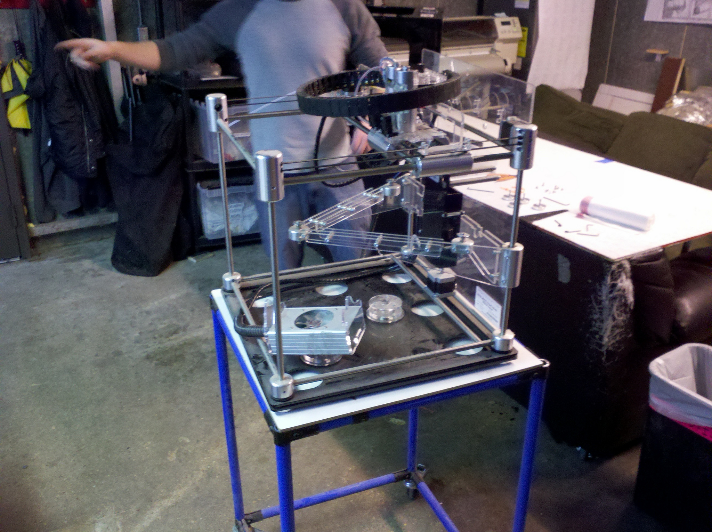

\[caption id="attachment\_683" align="alignnone" width="300"\] 3D Printer Taken Down to Essence\[/caption\]

We had [a party to take apart old tech](http://www.meetup.com/HackRVA-Meetup/events/219755580/) in the name learning.

Taking things apart is a great way to examine the objects in our daily lives.  This fun activity also grows your maker insight as you learn about components, assembly, and materials.

To keep up with great events like this, join the [HackRVA Meetup Group](http://www.meetup.com/HackRVA-Meetup/).
