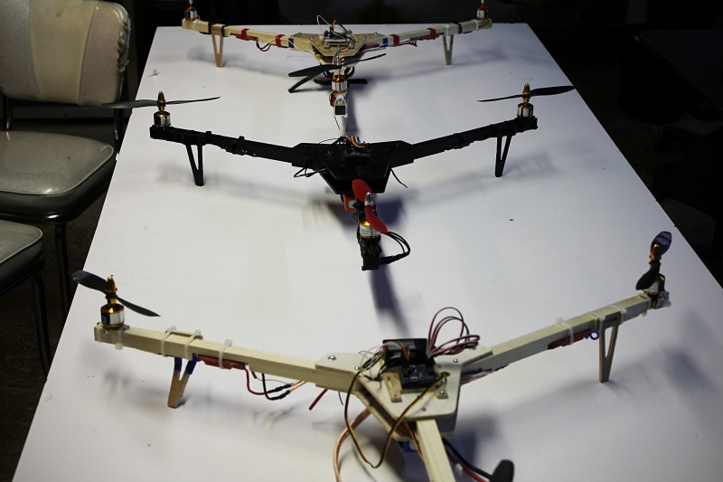

The HackRVA tricopter build group was a great learning experience. The build took place over three weekends and is still going on as members tweak their copters. Much soldering, wiring, testing, and crashing occurred!

We've seen multiple tri-copters flying around the space thanks to Andy's original kit and group leadership. He designed this build with cost in mind as well as ease of making. This has been an incredible experience for those looking to break into flight. Keep an eye out for future multi-copter and robot builds on our meetup and mailing list.

Thanks Andy!

Documentation [here](http://www.hackrva.org/wiki/index.php?title=2015_Tricopter_Build). More pics [here](https://www.flickr.com/photos/hackrva/sets/72157650222616501/).
