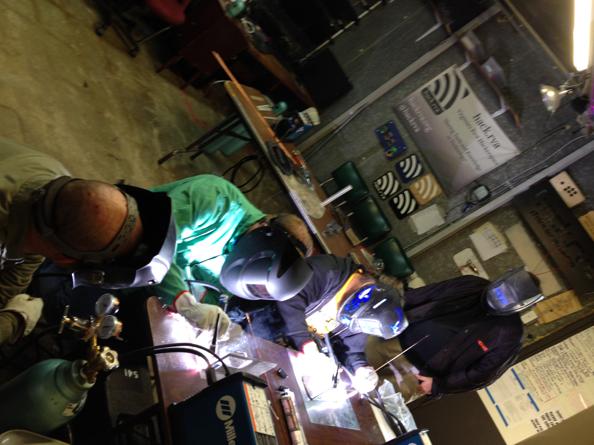
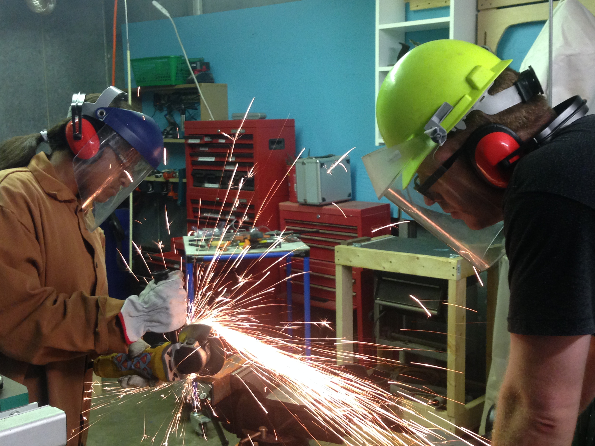

On Friday June 19th, and Saturday June 20th, a total of 16 people got together at Hack.RVA in order to learn welding techniques from our instructors.

Attendees got to learn about the differences between Tig, Stick, and Mig welding. They also got the chance to learn and/or practice their skills in grinding, Tig welding, and Stick welding.

Welding was performed using Miller Maxstar 150 S’s.

Special thanks to our instructors Morgan and Joseph! We look forward to doing more of these in the future!

Go [here for more photos](http://www.flickr.com/photos/hackrva/sets/72157655128156126)!

