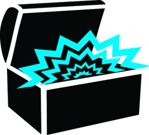
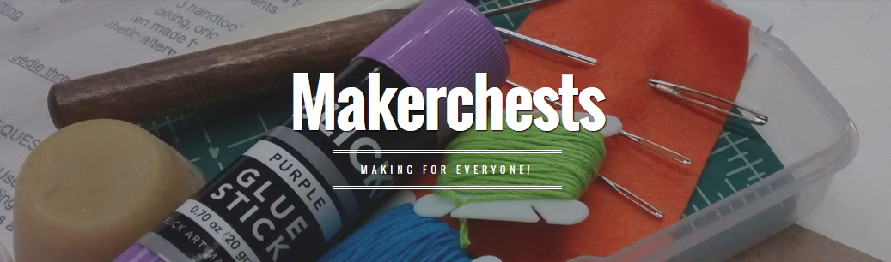

Makerchests is a project by hackrva members and friends to bring making to local schools in bite sized chunks. Each makerchest contains several mini-kits based on a theme. The mini-kits contain individual supplies and instructions to complete a number of related projects. The first makerchest has already debuted at Varina Highschool library and has been quite a success. This chest featured bookbinding kits. The chest also received a test-run with members at hackrva during a meetup so that our members could practice with the kits and give feedback.

To learn more about makerchests go to [http://makerchests.com/](http://makerchests.com/).

Or also read Mel's take on the book binding development here at [hackrva's very own project blog](http://hackrvamakes.blogspot.com/2016/03/makerchests-bookbinding-workshop.html).

