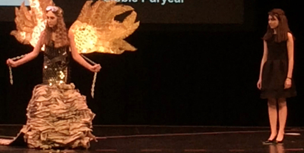
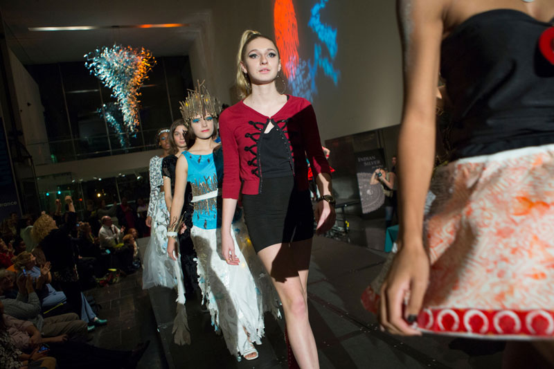
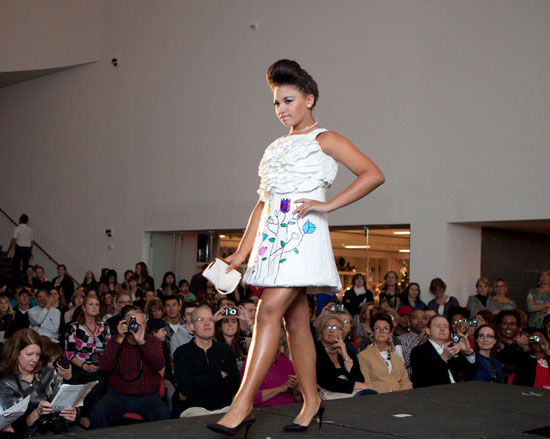
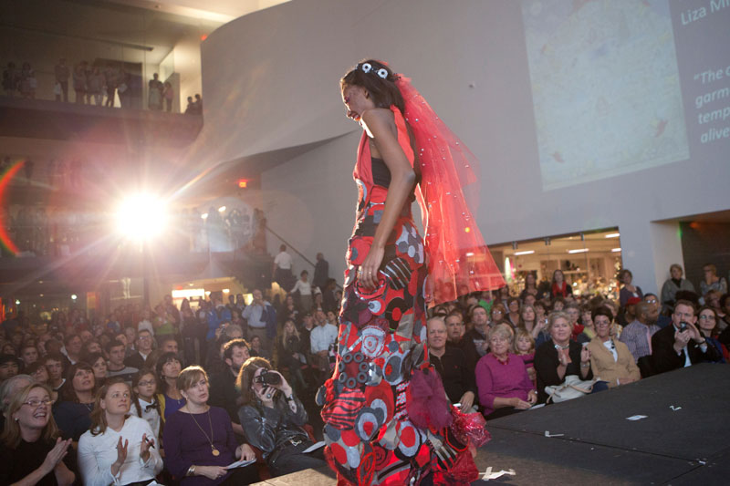
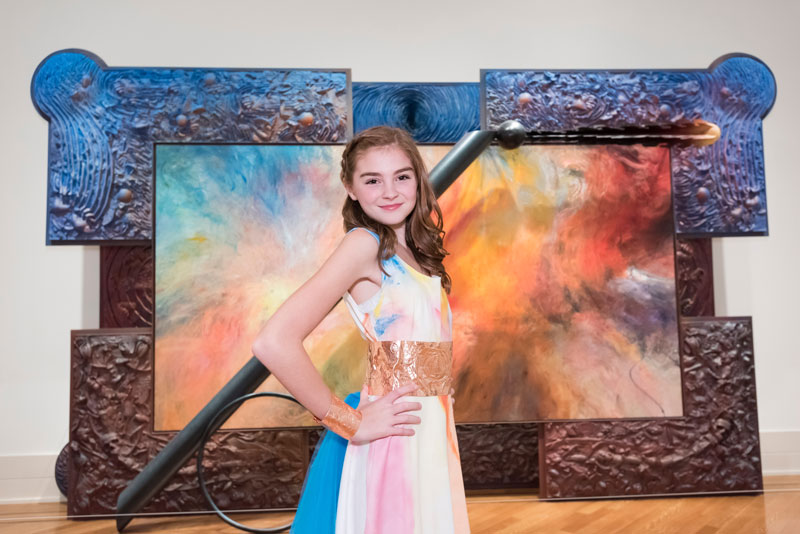
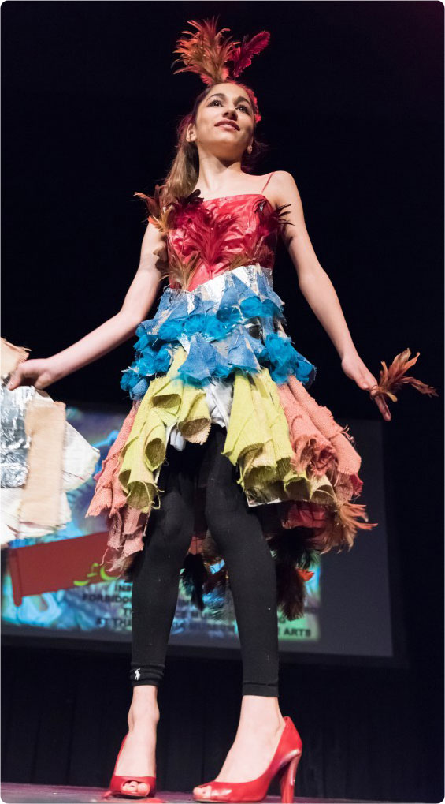

     

<iframe src="https://www.youtube.com/embed/dfFFdboo3jo" width="560" height="315" frameborder="0" allowfullscreen="allowfullscreen"></iframe>

Shellie and other HackRVA'ers have been working hard to bring some STEAM to the fashion world with the VMFA Teen Stylin' fashionistas!

This is the laser cutting a nautilus gear brooch we've creating for participants in the VMFA Teen Stylin' program. The gear set is an amalgamation of fashion and engineering meant to give a hands on familiarity in the the use of gears. The student designers will be able to decorate or mod them in unique ways.

More to come on this great pairing.

A link for the Teen Stylin': http://vmfa.museum/teens/teen-stylin/

A link for the original laser cutting file (we modded it): http://www.thingiverse.com/thing:750024

 

Update: Teen Stylin' was a great success! Way to go VMFA and fashion young aficionados!

https://vmfa.museum/teens/teen-stylin/about-teen-stylin/

https://www.pinterest.com/rosieadele/teen-stylin-2016-mood-board/

https://www.youtube.com/watch?v=h2MBApxfcdA
