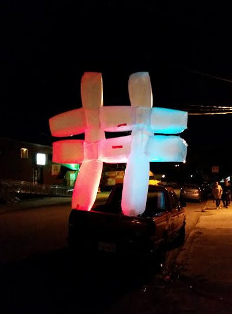
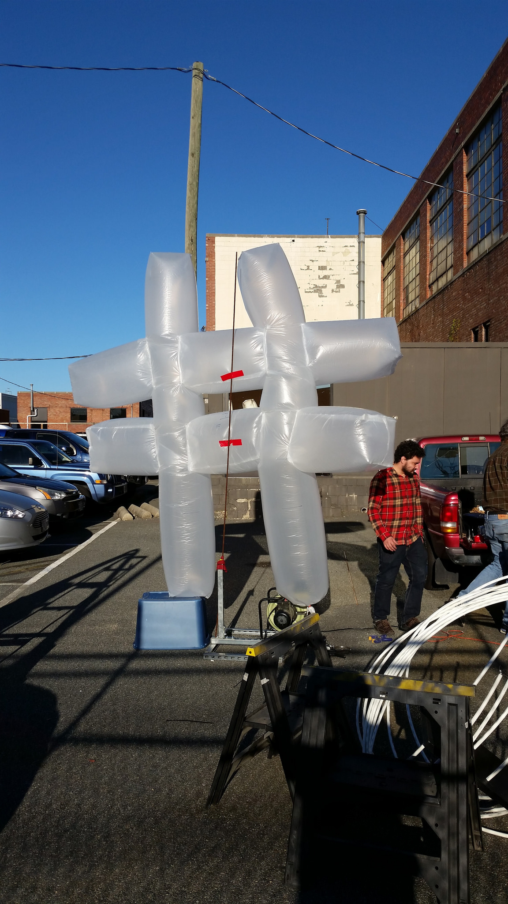

https://youtu.be/wN6E5KKsF5A?t=1s

Since [InLight](http://www.1708gallery.org/inlight/currentinlight.html) was at Scott's Addition this year, we decided to participate even though we were a couple blocks away from the main event. The sculpture above (made from [hacker lights](http://hackerlights.com/),  pex tubing, and wood) was led by Charli, Shellie, and Andy. We love it so much we're considering making it a permanent installation in the HackRVA building.

Another team (led by myself, Laura, and Eli) built an inflatable hashtag which we put in the street as well. This one lit-up based on tweets mentioning InLight or HackRVA.

A cool and unexpected twist of the night was that Uber drivers kept dropping people in front of our sculptures. We became the InLight entry point. After enjoying our displays the confused visitors were asking for directions. Of course we gave them. This went on most the night. It was hilarious and fun, plus we got a lot of eyes! I think this could be a strategy for other things - become the Uber stop.

For pics go to [our photostream here](https://www.flickr.com/photos/hackrva/albums/72157672451666383).

 
