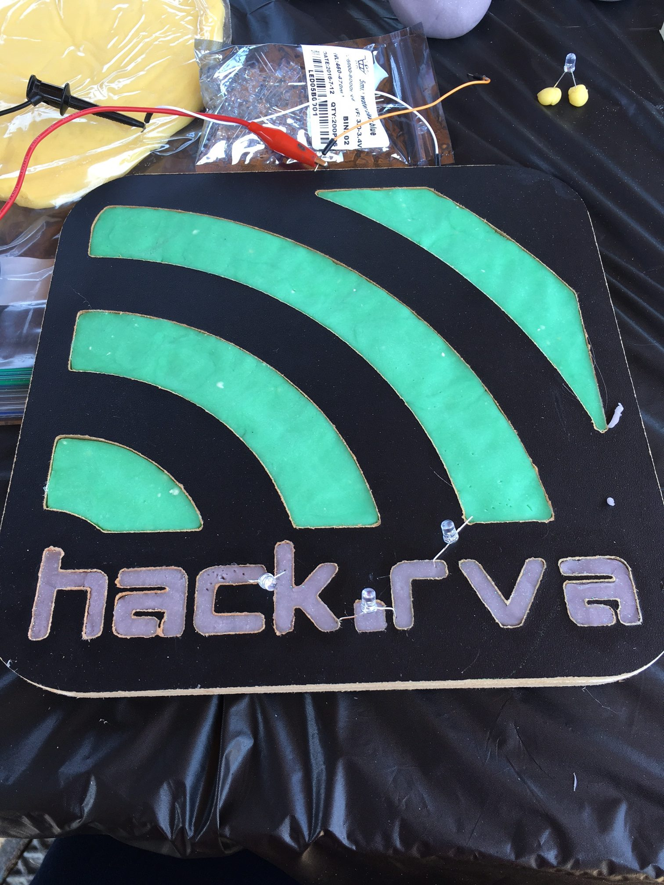
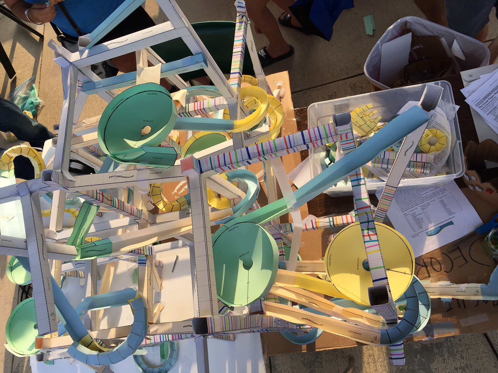
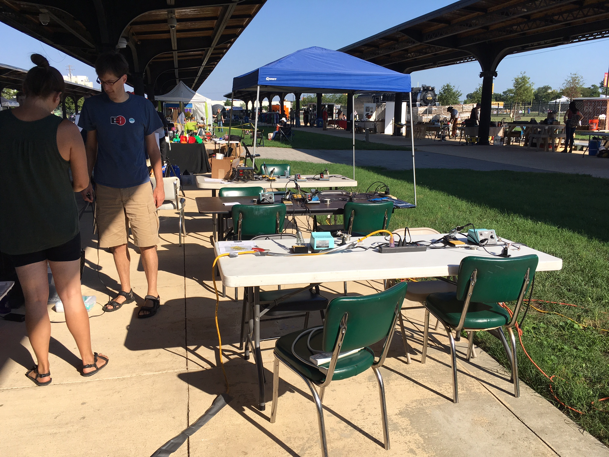

[MakerFest](http://rvamakerfest.com/) 2016 - WOOT!!!

We taught soldering with our friends at [William & Mary Small Hall makerspace](http://www.wm.edu/as/physics/resources/makerspace/),  built modular [paper roller coaster](http://paperrollercoasters.com/), and demonstrated basic electronics with [squishy circuits](http://tinkering.exploratorium.edu/squishy-circuits).

A glorious fun day. Thanks science museum and all the people who visited our tables and participated in this great event.

more pics [here](https://www.flickr.com/photos/hackrva/albums/72157674636335051).

\[embed\]https://www.youtube.com/watch?v=kFIf1wVcIPs&feature=youtu.be\[/embed\]
