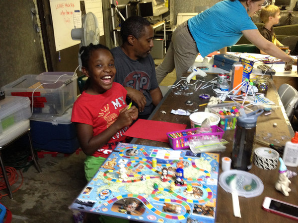
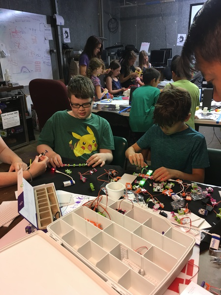
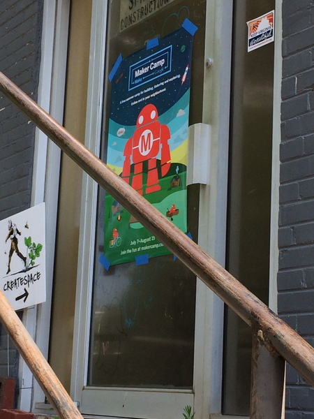
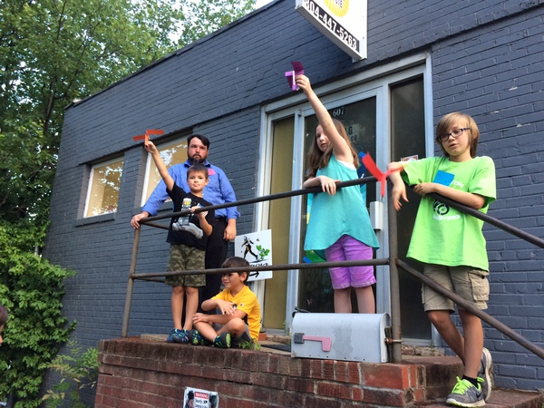
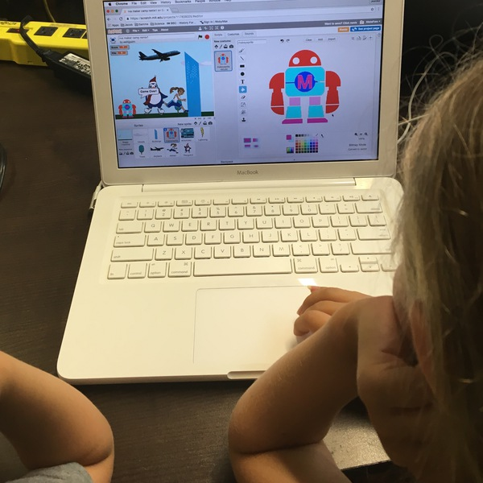
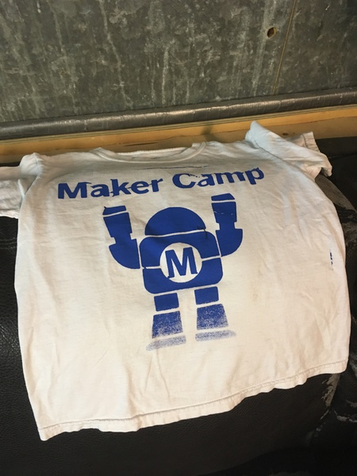

RVA Maker Guild put on a great event this year for STEAM education. In collaboration with Maker Media, HackRVA, and RVA Creatspace, they hosted two maker oriented workshops per week for six weeks. Way to go Maker Guild!

Electronics, paper craft, computing, kit building, fiber works, soft circuits, print making, and much more were introduced to multiple groups of excited youngsters. All put on by volunteers and free to the greater Richmond community!

To see more pics go here. And to see even more pic and learn about RVA Maker Guild go to the links below:

http://www.rvamakerguild.org/

https://www.facebook.com/rvamakerguild

http://www.meetup.com/RVA-Maker-Guild/

 
