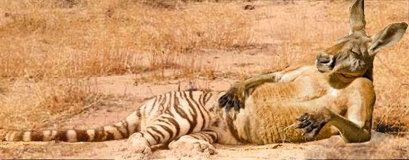

We recently held an [introduction to Photoshop workshop](http://www.meetup.com/HackRVA-Meetup/events/227861765/) where we learned to "composite" two animals together. Hence, the kanga-tiger above.

Along with GIFs, cats, and selfies, Photoshopped shenanigans are the foundation of our beloved inter-webs. This workshop taught how to contribute to that ongoing and important foundation effort.

In addition, practical skillz were learned. Blending, color matching, user interface jujitsu. Photoshop is where many many digital design projects begin - so its an import one to have some familiarity with.

Great thanks to Grey for once again teaching a stupendous workshop at HackRVA. That's three in the last several months - teacher of the year?
