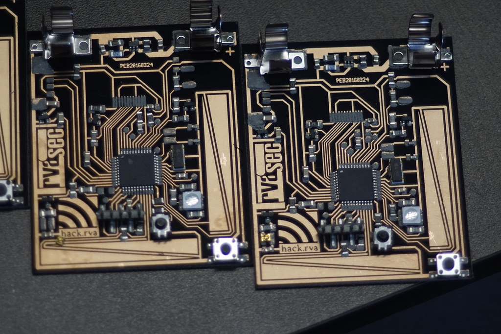
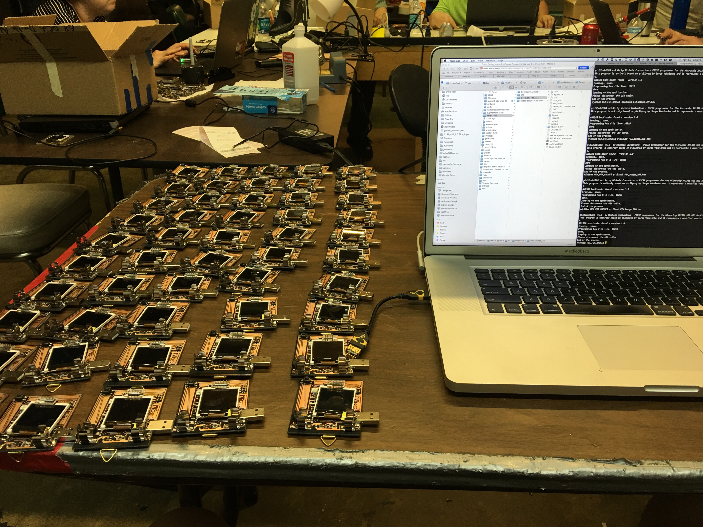

Each year a group of brave souls set forth to create an original hardware/software concoction known as B-A-D-G-E-S. This creation, whose first iteration was conceived in the ancient age of 2011, is a pandoras box of curiosities meant to sate the intellegence of RVAsec participants.

The badge features a color screen, multiple inputs and sensors, and boards-from-scratch made in the dark acid-fumed sheet-ensconced labs of hack.rva, Not to mention all the programming that went into the software/firmware.

For more on the badges, see the interview with the project leaders here: [http://rvasec.com/badges-hack-rva-at-it-again/](http://rvasec.com/badges-hack-rva-at-it-again/)

 
