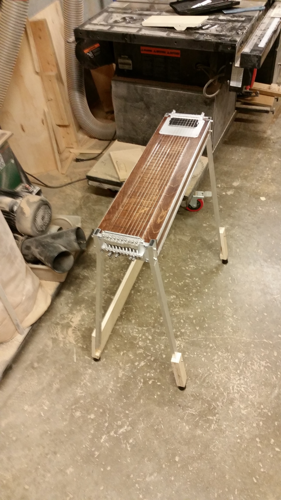
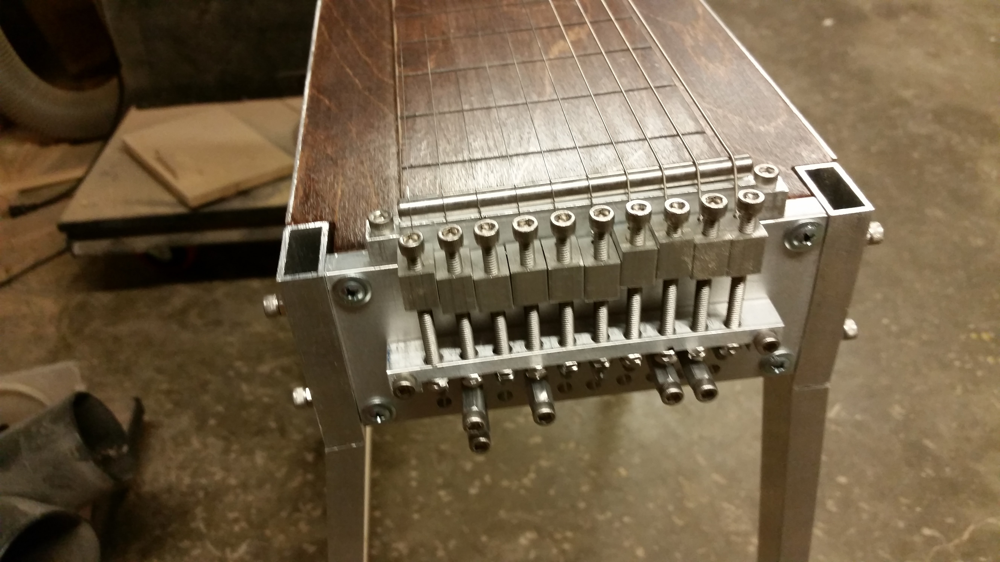
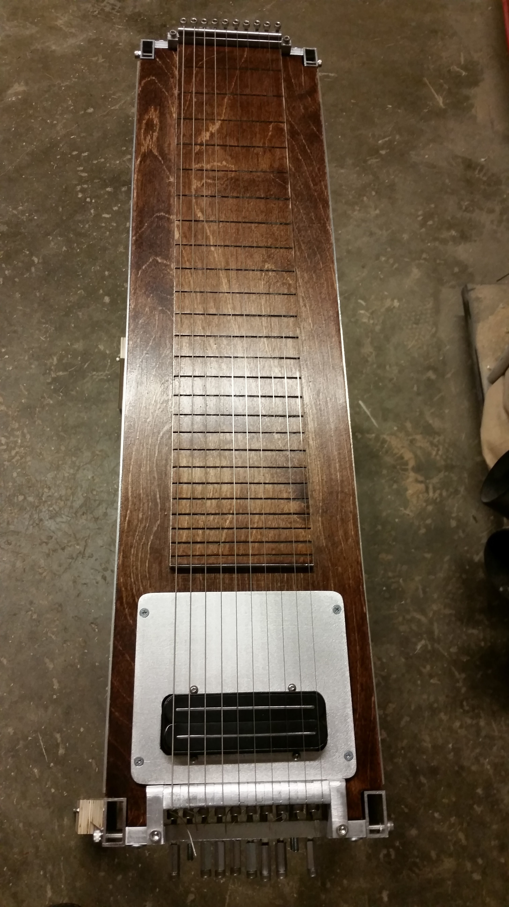

Um, dang!

I was sorta shocked that this beautiful instrument was made almost completely at HackRVA by Carl (and he did almost in secret).

There are many cool things that get made at hack, but I wanted to take a moment to point this one out. Just... yeah!

  
