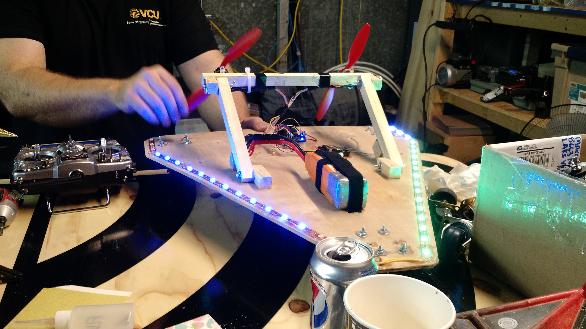

The video speaks for itself.  It is violent, fun, and almost out of control. This isn't your granddad's RC car.

<!-- <iframe style="position: absolute; width: 100%; height: 100%; left: 0;" src="https://www.youtube.com/embed/ZYNm-zxDYJ4?ecver=2" width="640" height="360" frameborder="0" allowfullscreen="allowfullscreen"></iframe> -->

Caster Car inventor Andy sez:

"Traction?  Brakes?  Since the advent of the Model T Ford, these have been widely assumed to be an essential part of the driving experience.

This is totally wrong.

With casters for wheels, caster cars have no traction, and no brakes.  They're always drifting, using the thrust from two propellers to control their motion.  A computer and gyroscope (a re-purposed drone flight controller), help to stabilize the vehicle.  Snow and water conversions are possible as well."

[Here's a link to the meetup](https://www.meetup.com/HackRVA-Meetup/events/237645032/) where HackRVA'ers built some. Racetrack competition pending!

